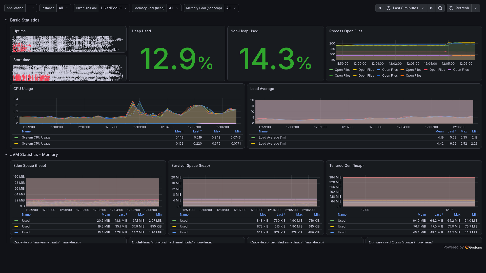
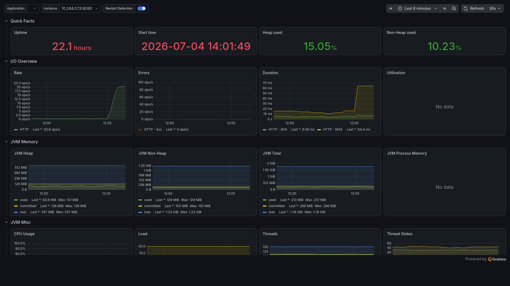
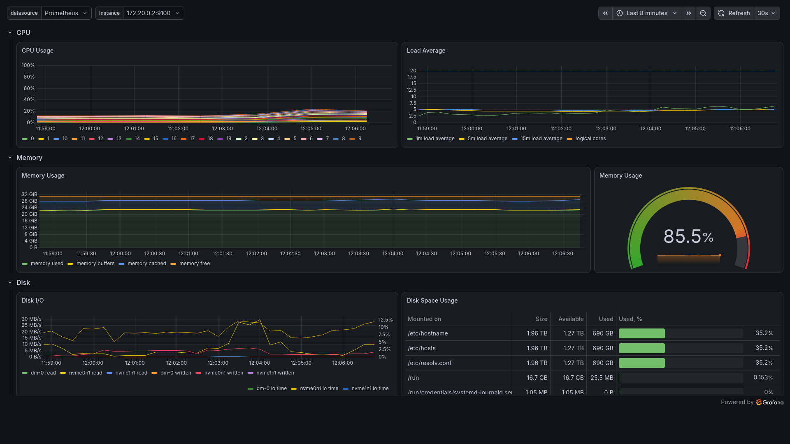

# Scalable E-Commerce Platform

A microservices e-commerce platform built on Java 21 and Spring Boot 3, with a
server-rendered SvelteKit storefront. It covers the full purchase journey —
catalog browsing and search, a cart, authenticated checkout, payment processing,
and asynchronous order fulfilment — and the entire stack starts with a single
Docker Compose command.

The design follows a few deliberate rules: REST at the edge, gRPC between
services, and a message broker alongside an event stream for everything
asynchronous. Identity is handled by Keycloak, search by Elasticsearch, and
observability by OpenTelemetry.

## Highlights

- Seven domain services (user, product, cart, order, payment, notification,
  recommendation) behind an API gateway, each owning its own database.
- OIDC authentication with Keycloak. The gateway validates access tokens against
  the realm JWKS and forwards the authenticated identity to downstream services.
- Synchronous service-to-service calls over gRPC, with a circuit breaker around
  the order-to-payment path.
- Two complementary asynchronous backbones: RabbitMQ for commands and work
  queues, Kafka for event streaming and fan-out, published reliably through a
  transactional outbox.
- Pluggable payments behind a single gateway abstraction — Stripe as the primary
  provider, Razorpay as a regional secondary, and a stub for local development —
  with signed webhooks and idempotent charges. Card data is never stored.
- Full-text product search and content-based "more like this" recommendations
  built on Elasticsearch.
- S3-compatible object storage for product media using presigned upload and
  download URLs (MinIO for local development, Cloudflare R2 in production).
- Distributed tracing with OpenTelemetry to Jaeger, metrics with Prometheus and
  Grafana, and a correlation id propagated across REST and gRPC.
- Aggregated OpenAPI documentation, a k6 load-test suite, and a CI pipeline that
  runs a dependency vulnerability scan.

## Architecture

Communication model: REST at the edge, gRPC between services, and RabbitMQ plus
Kafka for asynchronous messaging.

```
                            Browser
                               |
                          REST (SSR)
                               v
                   SvelteKit storefront  :3000
                               |
                     server-to-server REST
                               v
              +--------- API Gateway  :8080 ---------+
              |  token validation, rate limiting,    |
              |  security headers, correlation id,    |
              |  RFC 7807 error responses            |
              +--------------------------------------+
               |        |        |         |        |
             user    product   cart      order    payment
            (auth)  (catalog, (Redis)  (gRPC ->  (gRPC server,
                     search,            payment,  Stripe /
                     media)             outbox)   Razorpay)
                                          |          |
                                          |   RabbitMQ / Kafka
                                          v          v
                                  notification   recommendation
                                  (email)        (trending, similar)

   data stores: PostgreSQL (one database per service) · Redis · Elasticsearch
```

Supporting infrastructure: Spring Cloud Config, Eureka service discovery,
Keycloak, Kafka, RabbitMQ, Elasticsearch, MinIO, Prometheus, Grafana, and Jaeger.

### Cross-cutting concerns

Servlet services share a `common` library, auto-configured through Spring Boot so
each service inherits it by adding the dependency:

- **Uniform errors.** Failures are returned as RFC 7807 `application/problem+json`.
  Domain exceptions map to status codes (not found to 404, conflict to 409,
  unauthorized to 401, bad request to 400, unavailable to 503), with a safe
  catch-all 500.
- **Validation.** Bean Validation failures return 400 with a per-field error list.
- **Correlation id.** A servlet filter and gRPC interceptors propagate
  `X-Correlation-Id` across REST and gRPC and into the logging context.

gRPC contracts live in a shared `proto` module compiled to Java stubs, consumed by
the payment service (server) and the order service (client).

## Technology

| Area | Stack |
|------|-------|
| Language and runtime | Java 21 with virtual threads, Spring Boot 3.3, Spring Cloud 2023.0 |
| Storefront | Svelte 5, SvelteKit 2, adapter-node (server-side rendering) |
| Edge | Spring Cloud Gateway (reactive) |
| Authentication | Keycloak 26 (OIDC), Spring Security OAuth2 resource server |
| Service-to-service | gRPC, Protocol Buffers |
| Messaging | RabbitMQ, Apache Kafka |
| Data | PostgreSQL, Redis, Elasticsearch |
| Payments | Stripe, Razorpay |
| Object storage | S3 API (MinIO locally, Cloudflare R2 in production) |
| Email, analytics, support | Resend, PostHog, Chatwoot |
| Observability | OpenTelemetry, Jaeger, Prometheus, Grafana, Micrometer |
| Documentation and quality | springdoc OpenAPI, k6, OWASP Dependency-Check, GitHub Actions |
| Packaging | Docker, Docker Compose |

## Services

| Service | Responsibility |
|---------|----------------|
| api-gateway | Single entry point. Token validation, identity propagation, rate limiting, security headers, correlation id, error formatting. |
| user-service | Registration, login, and profile data. |
| product-service | Catalog, full-text search and recommendations (Elasticsearch), product media (object storage), Redis caching. |
| cart-service | Per-user cart backed by Redis. |
| order-service | Order placement, payment over gRPC, and event publication through a transactional outbox. |
| payment-service | gRPC payment server with a provider abstraction and signed webhooks for asynchronous settlement. |
| notification-service | Consumes order events and sends transactional email. |
| recommendation-service | Consumes order events to build trending and "frequently bought together" data. |

Discovery and configuration are provided by Eureka and Spring Cloud Config.

## Getting started

### Prerequisites

- Docker and Docker Compose (with BuildKit, the default on current Docker
  versions).
- No local JDK or Maven is required; builds run inside a container image.

### Run the stack

```bash
docker compose up --build
```

Startup is health-gated and proceeds in order: data stores, configuration server,
service discovery, application services, gateway, and finally the observability
tools.

| Component | URL |
|-----------|-----|
| Storefront | http://localhost:3000 |
| API gateway | http://localhost:8080 |
| API documentation (aggregated) | http://localhost:8080/swagger-ui.html |
| Keycloak | http://localhost:8081 |
| Service discovery (Eureka) | http://localhost:8761 |
| RabbitMQ management | http://localhost:15672 |
| Prometheus | http://localhost:9090 |
| Grafana | http://localhost:3001 |
| Jaeger | http://localhost:16686 |
| Object storage console (MinIO) | http://localhost:9001 |
| Elasticsearch | http://localhost:9200 |

Default credentials for the management consoles are configured in `.env`.

### Smoke test through the gateway

```bash
# Obtain an access token (realm "ecommerce", seeded user testuser/password).
TOKEN=$(curl -s -X POST \
  'http://localhost:8081/realms/ecommerce/protocol/openid-connect/token' \
  -H 'Content-Type: application/x-www-form-urlencoded' \
  -d 'grant_type=password&client_id=ecommerce-app&username=testuser&password=password' \
  | python3 -c "import sys, json; print(json.load(sys.stdin)['access_token'])")

# Create a product (write operations require authentication).
curl -s -X POST localhost:8080/api/products \
  -H "Authorization: Bearer $TOKEN" -H 'Content-Type: application/json' \
  -d '{"name":"Wireless Headphones","description":"Bluetooth, noise cancelling","category":"audio","brand":"Acme","price":99.9,"stockQuantity":10}'

# Search the catalog (read operations are public).
curl -s "localhost:8080/api/products/search?q=headphones"

# Place an order. The order service calls payment over gRPC and emits an event.
curl -s -X POST localhost:8080/api/orders \
  -H "Authorization: Bearer $TOKEN" -H 'Content-Type: application/json' \
  -d '{"totalAmount":99.9}'
```

### Configuring payments

Select a provider with `PAYMENT_PROVIDER` (`stripe` by default, `razorpay`, or
`stub`) and supply that provider's keys (`STRIPE_SECRET_KEY` and
`STRIPE_WEBHOOK_SECRET`, or `RAZORPAY_KEY_ID` and `RAZORPAY_KEY_SECRET`). With no
keys present the service falls back to the development stub.

## Building

To compile and package without running the stack:

```bash
docker run --rm -v "$PWD":/app -v ecommerce-m2:/root/.m2 \
  -w /app maven:3.9-eclipse-temurin-21 mvn -q -DskipTests package
```

The build is a multi-module reactor; the `common` and `proto` modules build first
and the services depend on them.

## Quality and operations

**Load testing.** With the stack running, drive traffic through the gateway using
the k6 container image:

```bash
k6/run.sh smoke    # single virtual user: health and product search
k6/run.sh load     # ramping load: browse, search, register, cart, and order
```

Scenarios live in `k6/`, with thresholds that fail the run on an SLO breach.

**Performance benchmarking & observability.** A full, reproducible bench lives in
[`perf/`](perf/README.md): it seeds the databases at any scale, drives realistic user
journeys with k6 (smoke → baseline → medium → heavy → stress → spike → soak), and streams
every metric into a Prometheus + Grafana + node-exporter + kube-state-metrics stack running
in the cluster. One command reruns the whole thing at a bigger dataset:

```bash
perf/run.sh all smoke demo       # seed + load + capture dashboards + report
perf/run.sh test stress stage1   # ramp 100→10k VUs, auto-abort at the breaking point
```

Dashboards below are captured automatically per run (`perf/run.sh capture` → dark-theme PNGs):

| Spring Boot / JVM under load | JVM (Micrometer) | Node / infrastructure |
|---|---|---|
|  |  |  |

Each run also produces a `report.md` (throughput, P50/P95/P99, error rate, slowest SQL from
`pg_stat_statements`, pod resource usage, scaling events) plus a diff against the previous run —
so every optimization is measured objectively. See [`perf/README.md`](perf/README.md) for the
per-scale command reference.

**Dependency scanning.** OWASP Dependency-Check runs behind the `security` Maven
profile, so normal builds are unaffected, and also runs in CI:

```bash
mvn -Psecurity org.owasp:dependency-check-maven:aggregate -DnvdApiKey=$NVD_API_KEY
```

Accepted findings and false positives are tracked in `owasp-suppressions.xml`.

**Continuous integration.** GitHub Actions builds the full reactor and runs the
dependency scan on every push and pull request.

## Implementation notes

- Product search is part of the product service (Spring Data Elasticsearch)
  rather than a separate search service.
- The configuration server runs in native mode from the classpath, so no external
  Git repository is needed for local development.
- Schemas use Hibernate's automatic update for development; production
  deployments should use managed migrations.
